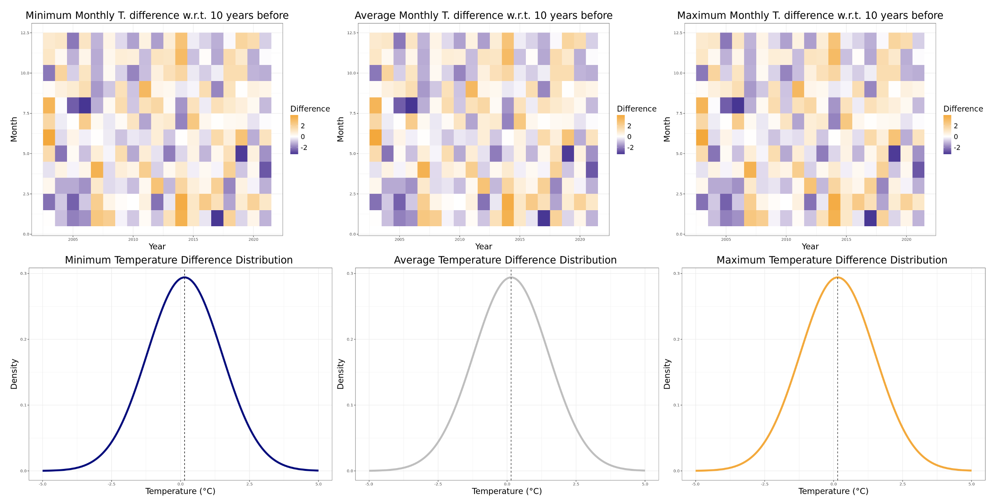
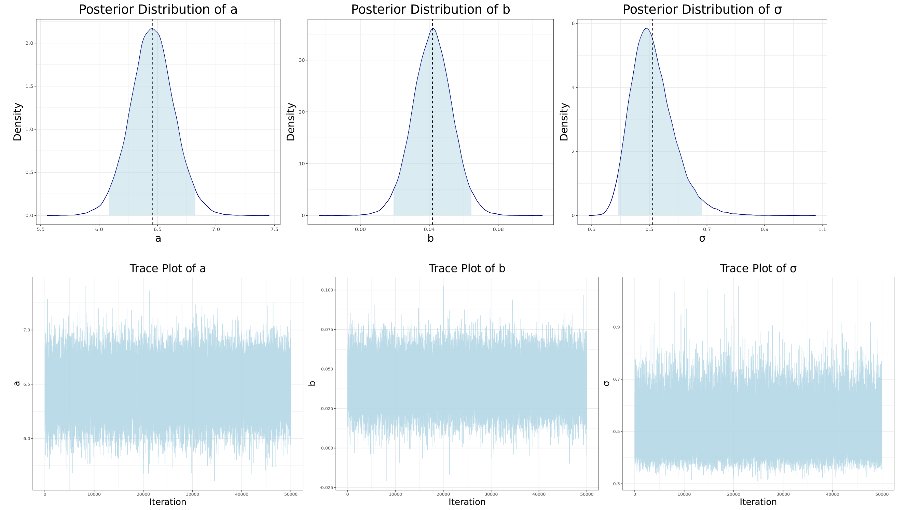
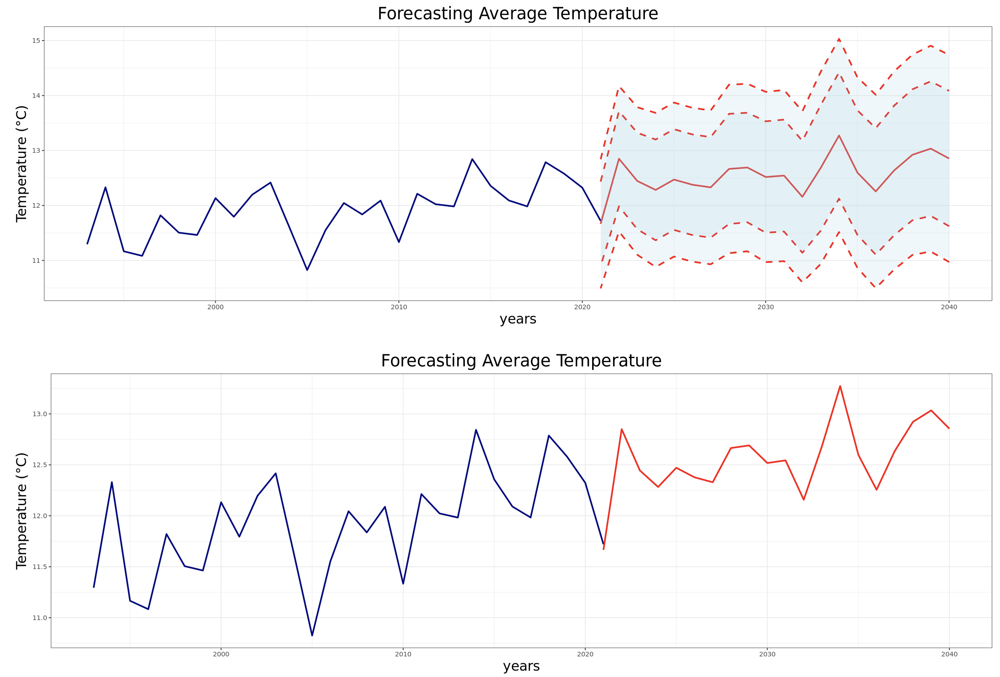

**Author**: Lorenzo Cavezza, Giacomo Longaroni  
**Project**: Advanced Statistics for Physics Analysis group  
**Tools**: R, JAGS, forecast, ARPAV dataset  

## Overview

This project involves a Bayesian statistical analysis of weather data from ARPAV, using statistical models implemented in R. The analysis includes Bayesian modeling with JAGS and time series forecasting with the `forecast` package. The study explores different models for predicting weather patterns including constant and linear regression implememted with MCMC and time forecasting using ARIMA models.

## Repo content

- **`Cavezza_Longaroni.ipynb`**: Notebook containing data loading, preprocessing, statistical modeling, and forecasting.
- **`const_model.jags`**: JAGS code for a constant regression used in Bayesian analysis.
- **`lin_model.jags`**: JAGS code for a linear regression used in Bayesian analysis.
- **`datiarpav`**: The folder containing the ARPAV dataset used for analysis.
- **`Plots`**: Directory storing the generated plots and visualizations used in the analysis.

## Key Concepts

1. **Bayesian Analysis**: Implemented using JAGS, focusing on constant and linear models for weather data analysis.
2. **Time Series Forecasting**: Implemented using the `forecast` package in R to predict future weather patterns.
3. **Model Evaluation**: Various diagnostic tools and plots are used to evaluate the performance of the models.

## Key Files

### Data Preprocessing
The ARPAV dataset is loaded and cleaned, ensuring that missing values and outliers are appropriately handled.

### Bayesian Models
Both models are implemented using JAGS, with results compared and validated through posterior predictive checks.

### Time Series Forecasting
Using the `forecast` package, the temperature time series is forecasted with an optimized arima model.

